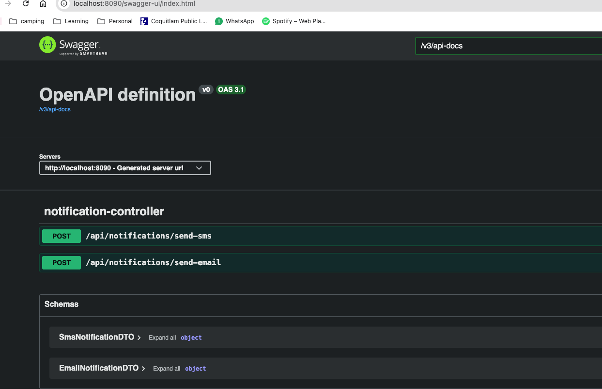

# Notification Service

This is a simple notification service built with Spring Boot. It provides API endpoints to send email and SMS notifications.

## Prerequisites

- Java 21 or later
- Maven
- SMTP server credentials
- Twilio account for SMS
- Lombok plugin for your IDE

## Setup

1. **Clone the repository:**

   ```bash
   git clone <repository-url>
   cd notification-service
   ```

2. **Configure SMTP settings:**

   Update the `src/main/resources/application.properties` file with your SMTP server details:

   ```properties
   spring.mail.host=smtp.example.com
   spring.mail.port=587
   spring.mail.username=your-email@example.com
   spring.mail.password=your-email-password
   spring.mail.properties.mail.smtp.auth=true
   spring.mail.properties.mail.smtp.starttls.enable=true
   ```

3. **Configure Twilio settings:**
   - create an account: https://login.twilio.com/u/signup
   - get the phone number: https://console.twilio.com/us1/develop/sms/try-it-out/send-an-sms
   - update the `src/main/resources/application.properties` file with your Twilio credentials:

   ```properties
   twilio.account.sid=your_account_sid
   twilio.auth.token=your_auth_token
   twilio.phone.number=your_twilio_phone_number
 
4. **Start Kafka**

   ```
   docker compose up -d
   ```

  - notifications

   ```
   docker exec -it kafka kafka-topics --bootstrap-server localhost:9092 --list
  ```

    
5. **Build and run the application:**

   Use Maven to build and run the application:

   ```bash
   mvn clean install
   mvn spring-boot:run
   ```

## Usage

Once the application is running, you can send notifications and check the API endpoints:

http://localhost:8090/swagger-ui.html



## License

This project is licensed under the MIT License - see the [LICENSE](LICENSE) file for details.
# notifcation
